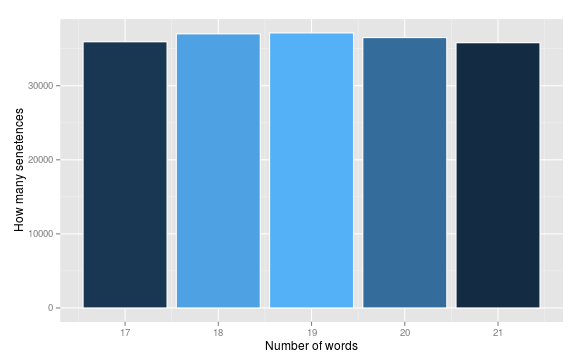
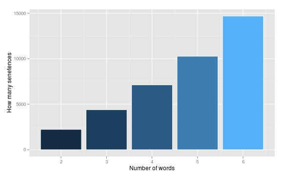

# NoSQL zadanie 2
Mateusz Miotk  
08.11.2014  

```
Sprzęt: 
Laptop ACER ASPIRE ONE 5820TG
Procesor: Intel core I5-430M
Ilość pamięci RAM: 4 GB
Dysk twardy: SSD SanDisk 128 GB
System Operacyjny: Linux Mint 17 x64
Wersja MongoDB: 2.6.5 oraz 2.8.0.rc0
Wersja PostgreSQL: 9.3.5
```

##Zadanie 2: Aggregacje w MongoDB: Angielskie sentencje.

###Przygotowanie danych

Do wykonania zadania 2 wykorzystałem bazę danych ze strony **kaggle.com**, które zawiera około 3 milionów sentencji angielskich.
Do eksperymentu wykorzystałem jedynie 1/3 tych danych. Jednak aby zapisać je w bazie MongoDB należy wstępnie przetworzyć te dane. Wykonuje to przy pomocy języka R.

####Format danych

Przetworzone dane są w następującej postaci: 

```
{
  "_id": ObjectId("546a54bc4fd537d62c6731c6"),
  "originalText": "what a world cup",
  "numberSentence": 20,
  "text": [
    "what",
    "a",
    "world",
    "cup"
  ],
  "howWords": 4
}

```

Aby jednak sprowadzić te dane do takiej postaci należy uruchomić skrypt **Load.R**.

Skrypt **Load.R** robi następujące rzeczy:

1. Czyta plik wiersz po wierszu.
2. Zamienia duże litery na małe oraz usuwa wszystkie znaki interpunkcyjne oraz dokonuje split sentencji.
3. Sprowadza dane wiersze do formatu **BSON**.
4. I wrzuca dane w tej postaci do MongoDB do kolekcji o nazwie **marta**.

UWAGA!!! 

1. Punkt **2** skryptu jest wykonywane **równolegle**.
2. Nie bierzemy pod uwagę sentencji jednowyrazowych.
3. Na raz przetwarzamy 25000 wierszy z pliku.
4. Wrzucanie danych robimy poleceniem **mongo.batch.insert()**.

|Przetwarzanie danych i wrzucenie danych|
|---------------------------------------|
|35 minut i 30 sekund MongoDB 2.6.5|
|21 minut i 18 sekund MongoDB 2.8.0.rc0 wiredtiger|

###Przykłady agregacji 

Interesować nas będą następujące pytania:

1. Zliczenie wszystkich słów i wypisanie 5 najczęstszych.
2. Wypisanie ilości słów najdłuższej sentencji.
3. Wypisanie z ilu słów jest najwięcej sentencji.
4. Wypisanie z ile sentencji ma najmniejszą ilość słów.

####Zliczenie wszystkich słów i wypisanie 5 najczęstszych.
#####Przypadek 1: javascript.
Wykonuje to skrypt **first.js**.

```
var options = {allowDiskUse: true, cursor: {batchSize: 4}};
var project = { $project: {text: 1, _id: 0}};
var unwind = { $unwind: "$text"};
var group = { $group: {_id: "$text", ilosc: {$sum : 1}}};
var sort = { $sort: {ilosc: -1}};
var limit = {$limit: 5};

var cursor = db.marta.aggregate([
  project,
  unwind,
  group,
  sort,
  limit
  ], options);
...
```

Wyjście: 

```
{ "_id" : "the", "ilosc" : 1363202 }
Średnia wynosi:  1.363202
{ "_id" : "to", "ilosc" : 606073 }
Średnia wynosi:  0.606073
{ "_id" : "of", "ilosc" : 575939 }
Średnia wynosi:  0.575939
{ "_id" : "a", "ilosc" : 550661 }
Średnia wynosi:  0.550661
{ "_id" : "and", "ilosc" : 537527 }
Średnia wynosi:  0.537527
```

#####Przypadek 2: rmongodb
Wykonuje to skrypt: **first.R**

```
mongo <- mongo.create()

if(mongo.is.connected(mongo)){
      mongo.get.databases(mongo)
      coll = mongo.get.database.collections(mongo,"test")
       project = mongo.bson.from.JSON('{ "$project": {"text": 1, "_id": 0}}')
       unwind = mongo.bson.from.JSON('{ "$unwind": "$text"}')
       group =  mongo.bson.from.JSON('{ "$group": {"_id": "$text", "ilosc": {"$sum" : 1}}}')
       sort = mongo.bson.from.JSON('{ "$sort": {"ilosc": -1}}')
       limit = mongo.bson.from.JSON('{"$limit": 5}')
      
       cmdList = list(project,unwind,group,sort,limit)

       result = mongo.aggregation(mongo,"test.marta",cmdList)
...
```

Wyjście: 

```
    word   count
the  the 1363202
to    to  606073
of    of  575939
a      a  550661
and  and  537527
```

####Wypisanie ilości słów najdłuższej sentencji.
#####Przypadek 1: javascript
Wykonuje to skrypt **second.js**

```
var options = {allowDiskUse: true, cursor: {batchSize: 4}};
var group = { $group: {_id: "$howWords", count: {$sum: 1}} };
var sort = { $sort: {count: -1}};
var sort2 = { $sort: {_id: -1}};
var limit = {$limit: 1};

var cursor = db.marta.aggregate([
  group,
  sort,
  sort2,
  limit
  ], options);

```

Wynik:

```
{ "_id" : 1643, "count" : 1 }
Najdłuższa sentencja posiada  1643  słów
```

#####Przypadek 2: rmongodb
Wykonuje to skrypt **Second.R**

```
if(mongo.is.connected(mongo)){
      mongo.get.databases(mongo)
      coll = mongo.get.database.collections(mongo,"test")

      group =  mongo.bson.from.JSON('{ "$group": {"_id": "$howWords", "count": {"$sum": 1}} }')
      sort = mongo.bson.from.JSON('{ "$sort": {"count": -1}}')
      sort2 = mongo.bson.from.JSON('{ "$sort": {"_id": -1}}')
      limit = mongo.bson.from.JSON('{"$limit": 5}')
      
      cmdList = list(group,sort,sort2,limit)
      
      result = mongo.aggregation(mongo,"test.marta",cmdList)

```

Wynik: 

```
 _id count 
 1643     1
```

####Wypisanie z ilu słów jest najwięcej sentencji.
#####Przypadek 1: javascript
Wykonuje to skrypt: **third.js**

```
var options = {allowDiskUse: true, cursor: {batchSize: 4}};
var group = { $group: {_id: "$howWords", count: {$sum: 1}} };
var sort = { $sort: {count: -1}};
var limit = {$limit: 5};

var cursor = db.marta.aggregate([
  group,
  sort,
  limit
  ], options);
  ...
```

Wynik: 

```
{ "_id" : 19, "count" : 37134 }
Sentencji z 19 słowami jest  37134
Stanowi to 4 % wszystkich sentencji
{ "_id" : 18, "count" : 37005 }
Sentencji z 18 słowami jest  37005
Stanowi to 4 % wszystkich sentencji
{ "_id" : 20, "count" : 36502 }
Sentencji z 20 słowami jest  36502
Stanowi to 4 % wszystkich sentencji
{ "_id" : 17, "count" : 35938 }
Sentencji z 17 słowami jest  35938
Stanowi to 4 % wszystkich sentencji
{ "_id" : 21, "count" : 35806 }
Sentencji z 21 słowami jest  35806
Stanowi to 4 % wszystkich sentencji
```

#####Przypadek 2: rmongodb

Wykonuje to skrypt: Third.R

```
...
if(mongo.is.connected(mongo)){
      mongo.get.databases(mongo)
      coll = mongo.get.database.collections(mongo,"test")
            
      group =  mongo.bson.from.JSON('{ "$group": {"_id": "$howWords", "count": {"$sum": 1}} }')
      sort = mongo.bson.from.JSON('{ "$sort": {"count": -1}}')
      limit = mongo.bson.from.JSON('{"$limit": 5}')
      
      cmdList = list(group,sort,limit)
      
      result = mongo.aggregation(mongo,"test.marta",cmdList)
      ...
```

Wynik: 

```
   word count
19   19 37134
18   18 37005
20   20 36502
17   17 35938
21   21 35806
```



####Wypisanie z ile sentencji ma najmniejszą ilość słów.
#####Przypadek 1: javascript
Wykonuje to skrypt: **four.js**

```
var options = {allowDiskUse: true, cursor: {batchSize: 4}};
var group = { $group: {_id: "$howWords", count: {$sum: 1}} };
var sort = { $sort: {_id: 1}};
var limit = {$limit: 5};

var cursor = db.marta.aggregate([
  group,
  sort,
  limit
  ], options);
  ...
```

Wynik:

```
{ "_id" : 2, "count" : 2236 }
{ "_id" : 3, "count" : 4400 }
{ "_id" : 4, "count" : 7126 }
{ "_id" : 5, "count" : 10274 }
{ "_id" : 6, "count" : 14695 }
```


#####Przypadek 2: rmongodb

Wykonuje to skrypt: **Four.R**

```
...
if(mongo.is.connected(mongo)){
      mongo.get.databases(mongo)
      coll = mongo.get.database.collections(mongo,"test")
      
      group =  mongo.bson.from.JSON('{ "$group": {"_id": "$howWords", "count": {"$sum": 1}} }')
      sort = mongo.bson.from.JSON('{ "$sort": {"_id": 1}}')
      limit = mongo.bson.from.JSON('{"$limit": 5}')
      
      cmdList = list(group,sort,limit)
      result = mongo.aggregation(mongo,"test.marta",cmdList)
...
```

Wynik: 

```
  word count
2    2  2236
3    3  4400
4    4  7126
5    5 10274
6    6 14695

```



####Przypadek 5: Zliczenie ilości słów w przedziale sentencji(grupowanie)

Wykonuje to skrypt: **five.js**

```
var result = db.marta.group({
  cond: {"numberSentence": {$gte: 2503, $lt: 2508}}
  , key: {numberSentence: true}
  , initial: {total_words_len: 0}
  , reduce: function(doc, out) { out.total_words_len += doc.text.length; }
  , finalize: function(out) { out.total_words_len }
} );

```

Wynik:

```
[
      {
		"numberSentence" : 2503,
		"total_words_len" : 22
	},
	{
		"numberSentence" : 2504,
		"total_words_len" : 6
	},
	{
		"numberSentence" : 2505,
		"total_words_len" : 13
	},
	{
		"numberSentence" : 2506,
		"total_words_len" : 21
	},
	{
		"numberSentence" : 2507,
		"total_words_len" : 57
	}
]

```

W **rmongodb** nie można wywołać takiego grupowania (nie ma polecenia mongo.group()).

####Tabelka

|Numer agregacji|Czas javascript|Czas rmongodb|Czas MongoDB 2.8.0.rc0|
|---------------|---------------|-------------|-------------------|
|1|0m13.735s |0m15.812s |0m19.354s|
|2|0m1.105s  |0m2.043s | 0m2.280s|
|3|0m1.126s  |0m2.070s |0m2.261s|
|4|0m1.108s  |0m2.077s | 0m2.294s|
|5|0m0.732s | -| 0m1.872s|


Statystyka

```
{
  "ns": "test.marta",
  "count": 999360,
  "size": 524198374,
  "avgObjSize": 524,
  "storageSize": 413085696,
  "nindexes": 1,
  "capped": false,
  "wiredtiger": {
    "uri": "statistics:table:collection-4--7287416412610174084",
    "LSM": {
      "bloom filters in the LSM tree": 0,
      "bloom filter false positives": 0,
      "bloom filter hits": 0,
      "bloom filter misses": 0,
      "bloom filter pages evicted from cache": 0,
      "bloom filter pages read into cache": 0,
      "total size of bloom filters": 0,
      "sleep for LSM checkpoint throttle": 0,
      "chunks in the LSM tree": 0,
      "highest merge generation in the LSM tree": 0,
      "queries that could have benefited from a Bloom filter that did not exist": 0,
      "sleep for LSM merge throttle": 0
    },
...

```
